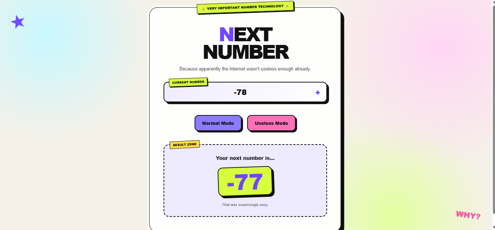
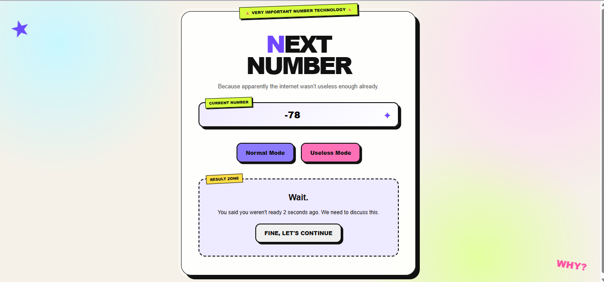
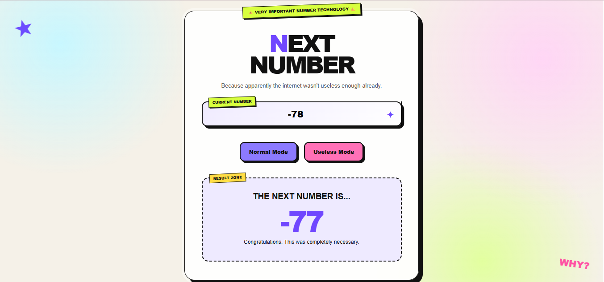

# Next Number 🎯

## Basic Details
### Team Name: Tally

### Team Members
- Team Lead: Helna Sajal C  - AISAT
- Member 2: Dazzlin Figaruz - AISAT

### Project Description
**Next Number** is a fun, intentionally useless website that gives you the next number you enter.
It has a **Normal Mode** for a quick answer and a **Useless Mode** that adds unnecessary questions and dramatic interactions.

### The Problem (that doesn't exist)
It solves the extremely serious problem of not knowing what number comes next — and makes the solution unnecessarily complicated.

### The Solution (that nobody asked for)
By adding 1 to the number—because apparently that wasn't unnecessarily complicated enough. In Useless Mode, we make you prepare emotionally, answer pointless questions, and wait dramatically just to reveal the next number. 😭

## Technical Details
### Technologies/Components Used
For Software:
- HTML,CSS,JavaScript
- None,built using vanilla web technologies 
- None
- VS Code,Git,GitHub,Web browser,HTML5 Audio API for sound effect

For Hardware:
- Laptop, speakers
- SPECIFICATIONS : Any modern commputer capable of running a web browser and code editor , internet connection for devolopment/GitHub
- TOOLS REQUIRED : VS Code, web browser, Git and GitHub

### Implementation
For Software:
# Installation
Since Next Number is built with plain HTML, CSS, and JavaScript, there are no external frameworks or libraries to install

# Run
This is a static website, there is no build command or backend server required.

### Project Documentation
For Software:

# Screenshots (Add at least 3)

*The main interface where the user enters a number and chooses between Normal mode and Useless mode.*

*Useless mode showing the unnecessary questions and dramatic interactions.*

*The final result showing the next number after the unnecessary journey.*

*Final result when chosen in normal mode.*

# Diagrams

*Add caption explaining your workflow*

For Hardware:

# Schematic & Circuit

*Add caption explaining connections*

*Add caption explaining the schematic*

# Build Photos

*List out all components shown*

*Explain the build steps*

*Explain the final build*

### Project Demo
# Video
[[Watch our project demo](demo.mp4)](https://drive.google.com/file/d/1nxvtRh2H-0XuBzlciNag-ZjPLZwa8fVY/view?usp=sharing)
*This video demonstrate the complete Next Number experience.*

# Additional Demos
[Add any extra demo materials/links]

## Team Contributions
- Helna Sajal C : README, Web Designing
- Dazzlin Figaruz: Frontend

---
Made with ❤️ at TinkerHub Useless Projects 

